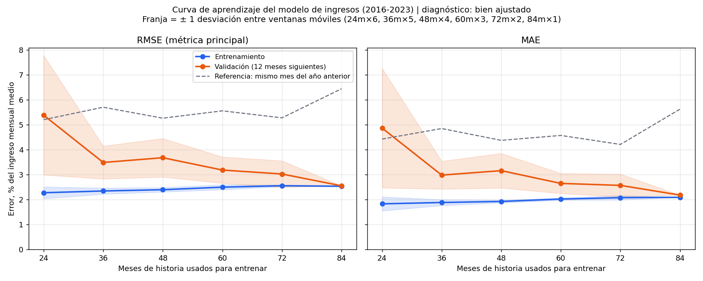

# Evaluación técnica del modelo de predicción de ingresos — HealthCore

Respuesta al ticket de evaluación formal antes de pasar a staging el modelo de `data/process/sales_forecast.py`, entregado en la clase anterior y descrito en `docs/sales-forecast.md`: tendencia log-lineal × Random Forest estacional sobre `revenue_usd` de la fila `consolidated`.

> **Diagnóstico: el modelo está bien ajustado.** Los errores de entrenamiento y validación convergen en un nivel bajo (RMSE 2,5-3 % del ingreso mensual) y muy por debajo de la referencia ingenua (5,7 %). No hay underfitting ni overfitting. El problema real es otro: **un desfase sistemático en los años de crecimiento bajo** (2020 y 2022), que explica casi la mitad del error de esos años. La acción correctiva es añadir a la tendencia el ciclo de crecimiento alterno que describe el CONTEXT. No se trata de añadir datos ni complejidad.

## Cómo reproducirlo

Desde la raíz del repo:

```bash
services/api/.venv/bin/python scripts/evaluate_sales_forecast.py
services/api/.venv/bin/python -m pytest tests/pipelines/test_sales_forecast_evaluation.py
```

| Pieza | Archivo |
|---|---|
| Pliegues temporales, curva, métricas y diagnóstico (lógica pura) | `data/process/sales_forecast_evaluation.py` |
| Ejecución, gráfico y JSON | `scripts/evaluate_sales_forecast.py` |
| Curva de aprendizaje | `data/eval/learning_curve.png` |
| Todas las cifras de este reporte | `data/eval/sales_forecast_evaluation.json` |
| Tests (orden cronológico de los pliegues, métricas, diagnóstico) | `tests/pipelines/test_sales_forecast_evaluation.py` |

Determinista (`random_state=42`), unos 10 s. Solo cifras agregadas mensuales: ningún dato de pacientes (CONTEXT, sección 1).

## Qué datos se usan y cuáles no

- **Toda la evaluación usa solo el entrenamiento: 2016-2023 (96 meses).** La prueba 2024-2025 sigue reservada como examen final. Si se usara aquí para decidir el diagnóstico o la acción correctiva, las métricas publicadas en `docs/sales-forecast.md` dejarían de ser una medida honesta. Un test (`test_temporal_cv_never_reaches_the_test_years`) lo fija.
- Mismo split 8/2 años que la clase anterior, reproducido con las mismas funciones (`load_sales_data`, `split_train_test`). El modelo no se ha modificado.
- **Hiperparámetros:** el enunciado supone que ya se ajustaron. En este proyecto el Random Forest usa los valores por defecto (500 árboles), una decisión documentada en la clase anterior. Este reporte muestra, además, que ajustarlos no es la palanca: ver la sección de la acción correctiva.

## 1. Validación cruzada temporal

`TimeSeriesSplit(n_splits=5, test_size=12)`: cada pliegue entrena con todos los meses anteriores y valida el año inmediatamente siguiente.

**Verificación explícita de que no se baraja.** `check_chronological_folds` se ejecuta cada vez que se crean pliegues y detiene la evaluación si alguno incumple el orden. Exige tres cosas:
- entrenamiento y validación son bloques de meses consecutivos;
- todo el entrenamiento es anterior a la validación;
- cada validación empieza después de la del pliegue anterior.

Además, un frame desordenado se rechaza en vez de reordenarse en silencio. Los tests comprueban que la verificación detecta un `KFold` barajado, un `KFold` sin barajar (valida 2016 entrenando con 2017-2023) y los pliegues en orden inverso.

| Pliegue | Entrena | Valida | RMSE % entr. | RMSE % valid. | MAE % entr. | MAE % valid. | Sesgo % valid. | RMSE % ingenua |
|---|---|---|---|---|---|---|---|---|
| 1 | 2016-2018 (36 m) | 2019 | 2,13 | 2,74 | 1,72 | 2,39 | −0,44 | 7,46 |
| 2 | 2016-2019 (48 m) | 2020 | 2,27 | **4,00** | 1,91 | 3,22 | **+2,67** | 4,38 |
| 3 | 2016-2020 (60 m) | 2021 | 2,38 | 3,41 | 1,97 | 2,71 | +0,14 | 6,12 |
| 4 | 2016-2021 (72 m) | 2022 | 2,53 | **3,40** | 2,01 | 2,89 | **+2,34** | 4,11 |
| 5 | 2016-2022 (84 m) | 2023 | 2,53 | 2,55 | 2,09 | 2,18 | −0,39 | 6,44 |

Cómo leer las columnas:
- **Porcentajes:** sobre el ingreso mensual medio de cada ventana. Como el ingreso crece ~4 % al año, un error en USD pesa distinto en 2016 que en 2023.
- **Sesgo:** error medio con signo. Positivo = el modelo sobreestima.
- **Ingenua:** la referencia "cada mes vale lo mismo que ese mes del año anterior".

### Media ± desviación estándar entre los 5 pliegues

Desviación estándar muestral (ddof=1).

| | RMSE | MAE |
|---|---|---|
| **Entrenamiento** | **2,37 ± 0,17 %** (61.509 ± 6.412 USD) | 1,94 ± 0,14 % (50.381 ± 5.189 USD) |
| **Validación** | **3,22 ± 0,58 %** (93.611 ± 15.342 USD) | 2,68 ± 0,41 % (77.879 ± 10.619 USD) |
| Referencia ingenua (validación) | 5,70 ± 1,42 % | — |

### Estabilidad (pregunta 2 del ticket)

**El desempeño es estable.** La desviación entre pliegues es 0,58 puntos sobre una media de 3,22 %, así que ningún año de validación supera el 4 %. Con 36 meses de historia el error ya es parecido al de 84 (2,74 % frente a 2,55 %), y la referencia ingenua es dos veces y media más inestable (± 1,42).

La variación que sí existe **no es aleatoria: sigue un patrón**. Los dos peores pliegues (2020 y 2022) son los dos con sesgo positivo claro. Se analiza en la sección 4.

## 2. Curva de aprendizaje



**Cómo se construye.** Para cada tamaño de historia (24, 36, 48, 60, 72 y 84 meses) se entrena con **todas las ventanas de ese largo** que caben en 2016-2023, desplazadas de año en año, y cada ventana valida los 12 meses siguientes. La franja es ± 1 desviación entre ventanas.

**Por qué ventanas móviles.** Con una única ventana anclada en 2016, "24 meses" validaría siempre 2018 y "84 meses" validaría 2023. La curva mezclaría el efecto de tener más datos con el de lo difícil que fue cada año.

| Meses de entrenamiento | Ventanas | RMSE % entrenamiento | RMSE % validación |
|---|---|---|---|
| 24 | 6 | 2,27 ± 0,24 | 5,38 ± 2,39 |
| 36 | 5 | 2,34 ± 0,12 | 3,49 ± 0,66 |
| 48 | 4 | 2,39 ± 0,09 | 3,68 ± 0,77 |
| 60 | 3 | 2,50 ± 0,10 | 3,18 ± 0,53 |
| 72 | 2 | 2,55 ± 0,03 | 3,02 ± 0,53 |
| 84 | 1 | 2,53 (sin dispersión: 1 ventana) | 2,55 |

### Interpretación del patrón

- **Entrenamiento: sube despacio y se aplana en ~2,5 %.** Es lo esperado cuando el modelo no memoriza. Con más meses hay más ruido que no puede "aprenderse de memoria".
  - Ese 2,5 % coincide con el suelo de ruido del dataset. El CONTEXT dice que los meses fluctúan ±5 % alrededor de la tendencia, lo que da una desviación típica de ~2,9 % (5/√3) para un ruido uniforme.
  - El bosque solo recibe el mes del año, así que en la práctica aprende 12 valores (uno por mes). Se queda ligeramente por debajo de ese ruido, pero no puede llegar a 0.
- **Validación: baja de 5,4 % a ~3 %, y su dispersión cae de ± 2,4 a ± 0,5.**
  - Con 2 años la tendencia se estima mal: una recta sobre 24 puntos con estacionalidad fuerte extrapola con mucho error.
  - A partir de 60 meses la ganancia es marginal.
- **Las dos curvas convergen** en un error bajo y cercano, con una brecha de ~0,5-0,9 puntos entre 60 y 72 meses. El punto de 84 meses (brecha 0,02) es una sola ventana y **no se usa como evidencia principal**, porque no tiene dispersión con la que compararlo.
- **La brecha que queda no es memorización.** Validar es predecir un año que el modelo no vio, y eso añade el error de extrapolar la tendencia 12 meses. La sección 4 muestra de dónde viene casi la mitad de ese error en los años peores.

## 3. Métricas: MAE y RMSE, y por qué la principal es RMSE

Las dos están calculadas arriba para entrenamiento y validación. **La métrica principal es RMSE**:

1. **El CONTEXT se centra en los meses atípicos, no en el mes promedio.** Sandra usa el modelo para distinguir "un agosto bajo normal" de "una caída atípica que amerite atención, por ejemplo un problema de capacidad clínica". Lo caro para HealthCore es fallar mucho en un mes concreto: tomar un agosto normal por una crisis, o no ver una caída real. El RMSE eleva los errores al cuadrado antes de promediar, así que un solo mes muy fallado lo sube claramente. El MAE lo diluye entre los meses buenos. El test `test_rmse_is_never_below_mae_and_grows_with_one_big_miss` lo fija: igual MAE, mayor RMSE con un fallo grande.
2. **Los meses de más ingreso son los de mayor riesgo.** En octubre-diciembre (+15-20 %, temporada de gripe) un mismo porcentaje de error supone más USD, y es cuando se planifica capacidad clínica.
3. **Es la raíz del MSE que el CONTEXT pide reportar** "en USD² y como porcentaje del ingreso mensual promedio". Reportar RMSE en % mantiene la misma familia de métricas que ya leen Tom (Revenue Cycle) y Sandra, en una unidad interpretable.

El MAE sigue siendo útil como lectura complementaria: *"de media nos desviamos ~78.000 USD al mes"*. El cociente RMSE/MAE en validación es 1,20 (3,22 / 2,68). Para errores sin meses extremos se espera ~1,25, así que hoy ningún mes dominado por un fallo enorme distorsiona el promedio. Precisamente por eso conviene vigilar el RMSE: es el que avisará si eso cambia.

**Aclaración sobre el CONTEXT:** no dice explícitamente si es peor sobreestimar o subestimar. Si Finanzas definiera un costo asimétrico (por ejemplo, que sobreestimar lleve a contratar de más), habría que complementar RMSE con el sesgo con signo, que este reporte ya calcula.

## 4. Diagnóstico (pregunta 1 del ticket)

**Clasificación: bien ajustado.** La regla está implementada en `diagnose_fit` y tiene tests por cada veredicto. Se aplica sobre la media de los 5 pliegues:

| Criterio | Regla | Valor | Resultado |
|---|---|---|---|
| Underfitting | error de entrenamiento ≥ referencia ingenua | 2,37 % frente a 5,70 % | No: aprende el patrón (-58 % de error) |
| Overfitting por brecha | validación ≥ 1,5 × entrenamiento | 3,22 / 2,37 = **1,36** | No, con un margen de 0,14 hasta el umbral |
| Overfitting por generalización | validación ≥ referencia ingenua | 3,22 % frente a 5,70 % | No: fuera de muestra mejora la referencia un 43 % |

Se comprueba primero el underfitting, porque un modelo que falla en todo puede tener poca brecha y colarse como "bien ajustado".

**El veredicto no depende de un redondeo.** Además de la tabla, la curva de aprendizaje lo respalda sin necesidad de umbrales: el entrenamiento se queda en el suelo de ruido, la validación desciende hacia él y la dispersión entre ventanas se reduce.

## 5. Problema detectado y acción correctiva (pregunta 3 del ticket)

### El problema: desfase sistemático en los años de crecimiento bajo

El CONTEXT describe un crecimiento que **alterna cada año** entre `X+Y = 6 %` y `X−Y = 2 %`. Los datos de entrenamiento lo confirman:

| Año | 2017 | 2018 | 2019 | 2020 | 2021 | 2022 | 2023 |
|---|---|---|---|---|---|---|---|
| Crecimiento anual real | +5,6 % | **+1,2 %** | +6,9 % | **+2,1 %** | +5,4 % | **+2,1 %** | +6,0 % |

La tendencia del modelo es una sola recta de crecimiento medio (4,16 %). En los años de crecimiento bajo predice un nivel demasiado alto, y **los dos peores pliegues son exactamente los dos años de crecimiento bajo que se validan**:

| Año validado | Crecimiento real | Sesgo | RMSE | Parte del error cuadrático debida al sesgo (sesgo² / RMSE²) |
|---|---|---|---|---|
| 2019 | +6,9 % | −0,44 % | 2,74 % | 3 % |
| 2020 | **+2,1 %** | **+2,67 %** | **4,00 %** | **45 %** |
| 2021 | +5,4 % | +0,14 % | 3,41 % | 0 % |
| 2022 | **+2,1 %** | **+2,34 %** | **3,40 %** | **47 %** |
| 2023 | +6,0 % | −0,39 % | 2,55 % | 2 % |

Casi la mitad del error de esos años no es ruido: es el mismo desplazamiento de nivel durante los 12 meses. Esa es la causa raíz de la brecha entre entrenamiento y validación, y de que la estabilidad no sea mayor.

### Acción correctiva: añadir el ciclo de crecimiento alterno a la tendencia

**Qué hacer:** en `data/process/sales_forecast.py`, añadir a `TREND_FEATURES` una variable de calendario `year_parity`: `(año − año de origen) mod 2`. Con ella, la regresión lineal sobre `log(ingreso)` aprende la recta del crecimiento medio y, además, el escalón de nivel que separa los años alternos. En logaritmos, un crecimiento que alterna 6 % / 2 % es exactamente una recta más un escalón cada dos años. La variable se conoce de antemano para cualquier mes futuro, así que no hay fuga de datos.

**Evidencia.** Prueba exploratoria con esta misma validación cruzada, solo sobre 2016-2023 y sin tocar el modelo del repo:

| | RMSE % validación (media ± desv.) | Sesgo por pliegue (2019 → 2023) | RMSE % por pliegue |
|---|---|---|---|
| Modelo actual | 3,22 ± 0,58 | −0,44 / **+2,67** / +0,14 / **+2,34** / −0,39 | 2,74 / 4,00 / 3,41 / 3,40 / 2,55 |
| Con `year_parity` | **2,98 ± 0,45** | +1,00 / +0,97 / +1,40 / +0,95 / +0,72 | 2,89 / 3,13 / 3,69 / 2,61 / 2,61 |

- **Mejora:** el error medio baja un 7 % y la dispersión un 22 %, y 2020 y 2022 dejan de ser casos aparte.
- **Coste:** 2019 y 2021 empeoran ligeramente, y aparece un sesgo positivo casi constante de ~+1 %. Ese sesgo es un efecto nuevo que habría que investigar antes de adoptar el cambio.

**Por qué esta acción y no las genéricas:**
- **No "más datos":** la curva de aprendizaje ya está plana desde 60 meses. Pasar de 72 a 84 meses mejora la validación en décimas, y el desfase de 2020/2022 se repite con cualquier tamaño, porque la recta sigue sin representar la alternancia.
- **No "más complejidad" en el Random Forest** (más árboles, más profundidad, otros hiperparámetros): el bosque solo modela la estacionalidad y su error de entrenamiento ya está en el suelo de ruido del dataset (~2,5 % frente a ~2,9 % teórico). El sesgo nace en la tendencia, que es lineal, así que ningún ajuste del bosque lo corrige.
- **No regularización:** no hay overfitting que frenar. Regularizar la tendencia la haría todavía más rígida y aumentaría el desfase.

**Condiciones antes de aplicarla** (por eso queda propuesta y no implementada en este ticket):
1. **Confirmar con Tom (Revenue Cycle) que la alternancia es estructural** (por ejemplo, ciclos bienales de tarifas o contratos) y no una casualidad de estos 8 años. Si no lo es, esta variable memorizaría un patrón que no se repetirá, y la alternativa sería reentrenar al cierre de cada mes para que el nivel se recoloque con los datos más recientes.
2. **Explicar el sesgo de +1 %** que aparece con la variable nueva.
3. **Repetir esta misma evaluación** (`scripts/evaluate_sales_forecast.py`) y, solo si el diagnóstico sigue siendo "bien ajustado" con mejor estabilidad, volver a medir **una única vez** sobre la prueba 2024-2025 y actualizar `docs/sales-forecast.md`.

## Resumen para el PR

El modelo está **bien ajustado**: RMSE de validación 3,22 ± 0,58 % frente a 2,37 % en entrenamiento, con las dos curvas convergiendo cerca del ruido del dataset y muy por debajo de la referencia ingenua (5,70 %). La acción correctiva propuesta es modelar el crecimiento alterno 6 %/2 % en la tendencia, que explica casi la mitad del error de 2020 y 2022; no se recomienda añadir datos ni complejidad.
