# Diseño — Pipeline de Desempeño de Negocio (Partes 1 y 2 de 3)

> **Pipeline:** `monthly_clinic_supply_performance`
> **Entregable de negocio:** "Reporte Mensual de Desempeño de Insumos por Clínica"
> **Audiencia:** Dra. Okonkwo (CEO) y Claire (Chief Compliance Officer)
> **Estado:** Parte 1 (diseño) en `feat/business-pipeline-design` · **Parte 2 (implementación resiliente) en `feat/resilient-business-pipeline`** · Parte 3 pendiente (subflows, tests y dashboard)
> **Fecha:** 2026-09-13

## Cómo ejecutarlo

```bash
# Desde la raíz del repo, con el venv de la API (tiene Prefect y lee DATABASE_URL de services/api/.env)
services/api/.venv/bin/python data/pipelines/pipeline.py                            # último mes cerrado
services/api/.venv/bin/python data/pipelines/pipeline.py --month-start 2026-08-01   # un mes concreto
```

- **Frecuencia prevista del ciclo de reporting:** mensual, **día 1 a las 02:00 UTC** (cierre del mes anterior, listo antes del primer día hábil, como exige el CONTEXT) y **día 8 a las 02:00 UTC** (reconciliación de eventos tardíos, misma ventana). Además, disparo manual desde `POST /reporting/pipeline-runs` (solo admin).
- No hace falta arrancar un servidor de Prefect: sin `PREFECT_API_URL`, Prefect levanta su API efímera dentro del propio proceso. El programador (los dos cron) es trabajo de despliegue, fuera de esta entrega (§9.4).
- Código de salida `0` si la corrida termina `completed` o `completed_with_warnings`; `1` si falla (el error queda en `reporting.pipeline_runs`).
- Lo implementado y en qué se aparta del diseño original: **§9**.

Este documento describe un pipeline **nuevo**. No sustituye ni modifica el reporte técnico de telemetría (`services/telemetry/analysis.py`, `GET /telemetry/report`), que sigue sirviendo a ingeniería igual que antes. `telemetry_events` es la **fuente** de este pipeline y se lee en modo solo lectura: nunca es su destino.

---

## Índice

1. [Estado actual](#1-estado-actual)
2. [Diseño del pipeline](#2-diseño-del-pipeline)
3. [Resiliencia, idempotencia y observabilidad](#3-resiliencia-idempotencia-y-observabilidad)
4. [Mapeo a Prefect](#4-mapeo-a-prefect)
5. [Integración con la aplicación](#5-integración-con-la-aplicación-solo-diseño)
6. [Respuestas a las 10 preguntas de diseño](#6-respuestas-a-las-10-preguntas-de-diseño)
7. [Cumplimiento HIPAA / UK GDPR](#7-cumplimiento-hipaa--uk-gdpr)
8. [Fuera de alcance de la v1](#8-fuera-de-alcance-de-la-v1)
9. [Implementación (Parte 2)](#9-implementación-parte-2)

---

## 1. Estado actual

### 1.1 Qué telemetría se captura hoy

El catálogo gobernado vive en `docs/telemetry/event-schemas.json` (24 eventos bajo un Event Envelope común: `eventId`, `timestamp`, `sessionId`, `userId`, `event_type`, `schemaVersion`, `requestId`, `properties`). De esos 24, este pipeline solo necesita los cuatro que exige el CONTEXT. Esta es su situación real en el código a fecha de hoy:

| `event_type` | Quién lo emite | ¿Llega a `telemetry_events`? | Propiedades relevantes |
| --- | --- | --- | --- |
| `inbound_order_created` | Frontend, `uis/backoffice/app/inventory/orders/inbound/page.tsx` tras un `POST /inventory/orders/inbound` correcto | **Sí**, vía `TelemetryService` → `POST /telemetry/events` (desde el fix del 2026-08-21; antes no llegaba ninguno) | `clinic_id`, `country`, `product_id`, `product_category`, `quantity`, `vendor_name`, `delivery_id`, **sin coste** |
| `outbound_order_created` | Frontend, `.../orders/outbound/page.tsx` | **Sí**, igual que el anterior | `clinic_id`, `country`, `product_id`, `product_category`, `quantity`, `department` (hoy siempre `null`), `consumption_type`, `consumption_id` |
| `stock_threshold_triggered` | Backend, `services/api/routes/inventory.py::_check_stock_threshold`, tras **cada** orden de entrada o salida si el stock de esa clínica queda ≤ umbral | **No**: `emit_backend_event` se llama sin `db_session`, así que solo se escribe en el log | `clinic_id`, `country`, `product_id`, `product_category`, `current_stock`, `threshold_value` |
| `supply_expiry_flagged` | Backend, `services/api/main.py::flag_expiring_supplies`, **una vez por cada arranque de la API** (stand-in de un job diario) | **No**: solo log | `clinic_id` (**hoy siempre `null`**), `country`, `product_id`, `product_category`, `expiry_date`, `days_until_expiry`, `quantity_at_risk` |

### 1.2 Dónde se almacena

Tabla `telemetry_events` en Supabase (PostgreSQL), modelo `TelemetryEventRecord` en `services/api/telemetry_models.py`. Es append-only: nunca se actualiza ni se borra.

| Columna | Tipo | Uso en este pipeline |
| --- | --- | --- |
| `id` | `text` (uuid4 generado en el servidor) | Rastro de la fila; **no** sirve para deduplicar, porque cada inserción genera uno nuevo |
| `timestamp` | `timestamp` (UTC) | Momento en que **ocurrió** el evento (no el de recepción). Define a qué mes pertenece |
| `service` | `text` | `backoffice` (frontend) o `api` (backend) |
| `event_type` | `text`, indexado | Filtro de extracción |
| `level` | `text` | No se usa (lo usa el reporte técnico) |
| `value`, `message` | `float` / `text` | No se usan |
| `tags` | `JSONB` (índice GIN) | `properties` **más** los campos de correlación del envelope: `eventId`, `sessionId`, `userId`, `requestId`, `schemaVersion` |

No existe una columna de "hora de recepción". Esto condiciona cómo se tratan los eventos tardíos (ver §3.2).

### 1.3 Qué responde ya el reporte técnico (ingeniería)

`GET /telemetry/report` (caché de 60 s) y la pantalla `/telemetry` del backoffice responden cuatro preguntas **técnicas** por día:

- `events_per_day`: ¿cuánto volumen de eventos entra y de qué tipo?
- `error_rate_by_day`: ¿qué proporción de eventos son errores (`level`)?
- `web_vital_latency_by_day`: ¿cómo se comporta la latencia percibida (Web Vitals)?
- `auth_failure_rate`: ¿qué proporción de logins fallan?

### 1.4 La brecha de negocio

El reporte técnico sabe **cuántos** `inbound_order_created` hubo en un día, pero no puede responder ninguna de las preguntas de la CEO:

- **¿Cuánto gastó cada clínica en insumos este mes?** No existe ningún dato de coste en la telemetría, y el reporte agrupa por día y tipo de evento, no por clínica.
- **¿Qué clínica está genuinamente ocupada y cuál tiene un hueco de captura?** El reporte cuenta eventos, pero no los contrasta con la actividad real registrada en inventario.
- **¿Cuántas veces se quedó una clínica bajo mínimo, y cuántos lotes estuvieron a punto de caducar?** Esos dos eventos ni siquiera se persisten hoy.
- **¿En qué moneda?** Nunca se deben sumar USD y GBP. El reporte técnico no distingue país.

Además, el reporte técnico calcula al vuelo sobre una ventana móvil de 7 días. Un paquete para la junta directiva necesita **números mensuales cerrados, estables y auditables**: el mismo mes debe dar el mismo número cada vez que se consulte, con constancia de quién lo recalculó y por qué cambió. Eso requiere un pipeline dedicado con su propia tabla de destino.

### 1.5 Requisitos previos detectados (bloquean la Parte 2)

Revisando el código contra el CONTEXT aparecen seis brechas. Sin resolverlas, el pipeline produciría números que parecen correctos pero no lo son. Todas son **extensiones de la captura**, no cambios del reporte técnico:

| # | Brecha | Consecuencia si no se resuelve | Resolución prevista (Parte 2) |
| --- | --- | --- | --- |
| P1 | `inbound_order_created` no lleva coste | `total_supply_cost` siempre 0 | **Resuelto (Parte 2):** `unit_cost` opcional en `docs/telemetry/event-schemas.json`, campo "Coste unitario (USD/GBP)" en el formulario de entregas del backoffice (`parseUnitCost`, vacío = desconocido, nunca 0) y en el payload de `track()`. La API de inventario no guarda coste: solo viaja en el evento |
| P2 | `stock_threshold_triggered` no se persiste | `critical_stockout_count` siempre 0 | **Resuelto (Parte 2):** `_check_stock_threshold` pasa `db_session=session` y además **solo emite al cruzar el umbral** (stock por encima antes de la orden, igual o por debajo después), para que el conteo literal del CONTEXT signifique "veces que cayó bajo mínimo" (§2.4) |
| P3 | `supply_expiry_flagged` no se persiste, sale con `clinic_id: null` y se emite en **cada arranque** de la API (con `--reload`, en cada guardado de archivo) | `expiry_risk_count` siempre 0; si se persistiera tal cual, inflado y sin clínica | **Resuelto (Parte 2):** `services/api/inventory_alerts.py` emite y persiste **un evento por lote `(clínica con stock > 0, producto, expiry_date)`, una sola vez**, con `eventId` determinista (`uuid5`) y comprobación previa de que no existe. Sigue corriendo en el arranque de la API, pero ya es idempotente. Cambio sobre el diseño original ("un evento por lote y día"): con un aviso único por lote, el conteo literal del CONTEXT es directamente "lotes marcados" |
| P4 | `department` siempre `null` | El desglose "por departamento" del KPI de consumo no es posible | Fuera de la v1 (la tabla del CONTEXT no tiene columna de departamento). Documentado, no bloquea |
| P5 | `clinic_id` es entero 1-12 en el proyecto, `text` en la tabla del CONTEXT, y no existe catálogo de nombres | — | **Decisión:** se respeta la columna `text` del CONTEXT y se guarda el id real como texto (`"7"`). No se inventan nombres de clínica. Un catálogo futuro solo añadiría una tabla de dimensión |
| P6 | `country` en los eventos es el país **del producto** (`MedicalSupply.country`), no de la clínica, y no existe un mapeo clínica→país | Una clínica podría aparecer con eventos `US` y `UK` el mismo mes, y la fila mezclaría monedas | La transformación **rechaza** la partición (clínica, mes) con más de un país distinto: no la carga y la registra en el log de la corrida (§2.4, paso 6). Nunca se mezclan monedas |

---

## 2. Diseño del pipeline

### 2.1 Propósito

> **Producir cada mes, listo el primer día hábil, el consolidado por clínica y país que alimenta el "Reporte Mensual de Desempeño de Insumos por Clínica" de la Dra. Okonkwo (CEO) y Claire (CCO), con sus cuatro KPIs: costo de insumos por clínica, volumen de consumo de insumos, frecuencia de quiebre crítico y conteo de riesgo de vencimiento. Se calculan a partir de las métricas obligatorias de telemetría `inbound_order_created`, `outbound_order_created`, `stock_threshold_triggered` y `supply_expiry_flagged`.**

Toda etapa de este documento se justifica contra esa frase. Lo que no la sostiene queda en §8.

### 2.2 Formato de extracción

**Fuente principal:** `telemetry_events` (Supabase, solo lectura).

```sql
-- extract_supply_events: una sola consulta por ventana mensual
SELECT id, "timestamp", event_type, tags
FROM telemetry_events
WHERE event_type IN (
        'inbound_order_created',
        'outbound_order_created',
        'stock_threshold_triggered',
        'supply_expiry_flagged'
      )
  AND "timestamp" >= :window_start   -- 2026-08-01 00:00:00 UTC (inclusivo)
  AND "timestamp" <  :window_end;    -- 2026-09-01 00:00:00 UTC (exclusivo)
```

- Se filtra por `event_type` y rango en SQL, apoyándose en los índices existentes (`ix_telemetry_events_event_type`, `ix_telemetry_events_timestamp`), y solo después se refina con Pandas. Es la misma fórmula que ya usa `analysis.py`.
- Se usa **inicio inclusivo y fin exclusivo en UTC**, la misma convención que fija `toReportQuery` en el dashboard técnico. `month_start` es el primer día del mes en UTC, como exige el CONTEXT. Consecuencia conocida: un consumo registrado a las 19:30 del 31 de agosto en Austin (UTC-5) cuenta para septiembre.
- **Cadencia de la fuente:** los eventos de frontend llegan en lotes cada ≤10 s o cada 20 eventos (`TelemetryService`), más `sendBeacon` al ocultar la pestaña. Los de backend se insertan en línea con la petición. La fuente se actualiza en casi tiempo real, pero el pipeline la consume en **batch mensual**.

**Forma del payload** (`tags`, JSONB) de cada evento de origen:

```jsonc
// inbound_order_created  → total_supply_cost
{ "clinic_id": 1, "country": "US", "product_id": 1, "product_category": "ppe",
  "quantity": 200, "vendor_name": "MedLine Industries", "delivery_id": 41,
  "unit_cost": 0.42,                         // nuevo, opcional (P1)
  "eventId": "6f1c…", "sessionId": "b27e…", "userId": "3c9a…",
  "requestId": "e01d…", "schemaVersion": "1.0.0" }

// outbound_order_created → supply_consumption_count
{ "clinic_id": 10, "country": "UK", "product_id": 2, "product_category": "ppe",
  "quantity": 15, "department": null, "consumption_type": "expiry_waste",
  "consumption_id": 77, "eventId": "…", "sessionId": "…", "userId": "…",
  "requestId": "…", "schemaVersion": "1.0.0" }

// stock_threshold_triggered → critical_stockout_count
{ "clinic_id": 1, "country": "US", "product_id": 1, "product_category": "ppe",
  "current_stock": 160, "threshold_value": 200, "eventId": "…",
  "sessionId": "backend", "userId": "3c9a…", "requestId": "…", "schemaVersion": "1.0.0" }

// supply_expiry_flagged → expiry_risk_count  (clinic_id no nulo tras P3)
{ "clinic_id": 1, "country": "US", "product_id": 6, "product_category": "medications",
  "expiry_date": "2026-09-28", "days_until_expiry": 15, "quantity_at_risk": 40,
  "eventId": "uuid5(…)", "sessionId": "backend", "userId": null,
  "requestId": "…", "schemaVersion": "1.0.0" }
```

**Fuentes de reconciliación** (solo lectura; **no** alimentan ningún KPI, solo auditan la captura): `supply_deliveries` y `supply_consumptions`. Se cuentan filas por `clinic_id` con `created_at` dentro de la ventana y se comparan con los eventos correspondientes (§3.4). No son tablas a nivel de paciente: no tienen ni pueden tener identificadores clínicos.

**Volumen esperado:** 12 clínicas, del orden de miles de eventos al mes. Una consulta por mes y un DataFrame en memoria bastan; no hace falta paginar en la v1. Un backfill procesa mes a mes (§4.5).

### 2.3 Flujo de datos

```mermaid
flowchart LR
    subgraph SRC["Fuentes (solo lectura)"]
        TE[("telemetry_events<br/>4 event_type")]
        SD[("supply_deliveries")]
        SC[("supply_consumptions")]
    end

    subgraph EXT["1 · Extracción"]
        E1["extract_supply_events<br/>SQL por ventana UTC"]
        E2["extract_domain_activity<br/>conteos por clinic_id"]
    end

    subgraph TRF["2 · Transformación (data/process)"]
        T1["flatten tags<br/>+ validar propiedades"]
        T2["deduplicar<br/>eventId → delivery_id / consumption_id"]
        T3["agrupar por clinic_id, month_start<br/>4 KPIs + currency"]
    end

    subgraph VAL["3 · Validación"]
        V1["validate_monthly_aggregates<br/>país único · cobertura · no negativos"]
    end

    subgraph LOAD["4 · Carga (una transacción)"]
        L1["upsert ON CONFLICT<br/>(clinic_id, month_start)"]
        L2["pipeline_run_partitions<br/>valores antes/después"]
    end

    subgraph DST["Destino · esquema reporting"]
        R1[("reporting.monthly_clinic_supply_performance")]
        R2[("reporting.pipeline_runs")]
        R3[("reporting.pipeline_run_partitions")]
    end

    API["services/reporting<br/>GET/POST /reporting/…"]

    TE --> E1 --> T1 --> T2 --> T3 --> V1
    SD --> E2
    SC --> E2
    E2 --> V1
    V1 -->|"ok / warnings"| L1 --> R1
    L1 --> L2 --> R3
    V1 -->|"fallo bloqueante"| R2
    L2 --> R2
    R1 --> API
    R2 --> API
```



Las etapas reales son **extracción → transformación → validación → carga**. La validación va separada de la transformación para que un rechazo de calidad (por ejemplo, captura rota) quede como un estado propio en el log, distinto de un bug de código.

### 2.4 Reglas de transformación

Funciones puras de Pandas en `data/process/supply_performance_transforms.py`, reutilizables y testeables sin base de datos:

1. **Aplanar** `tags` en columnas (`pd.json_normalize`) y convertir `timestamp` con `pd.to_datetime(..., utc=True)` antes de agrupar, igual que `analysis.py`.
2. **Validar propiedades mínimas**: `clinic_id` entero 1-12, `country` ∈ {`US`, `UK`}, `quantity` > 0 donde aplique, `unit_cost` ≥ 0 si viene. Las filas inválidas se excluyen y se cuentan (`rows_invalid`); no tumban la corrida. Es el mismo principio de rechazo parcial que `POST /telemetry/events`.
3. **Deduplicar** en dos niveles (§3.1): primero por `tags.eventId`, y después por la clave natural de dominio (`delivery_id` para entradas, `consumption_id` para salidas).
4. `clinic_id` → texto (`"7"`, decisión P5) y `month_start` = `timestamp` truncado al primer día del mes UTC.
5. **Calcular por `(clinic_id, month_start)`:**

   | Campo | Regla | KPI |
   | --- | --- | --- |
   | `total_supply_cost` | `SUM(quantity * unit_cost)` de `inbound_order_created` **con** `unit_cost`, redondeado a 2 decimales (`Decimal`, nunca `float` al persistir). Los eventos sin coste se excluyen del sumatorio y se cuentan en `inbound_events_missing_cost` para que el informe no presente un gasto parcial como completo | Costo de insumos por clínica |
   | `supply_consumption_count` | Conteo de `outbound_order_created` tras deduplicar. Se cuentan los dos `consumption_type` (`clinical_use` y `expiry_waste`): ambos son actividad de consumo registrada | Volumen de consumo de insumos |
   | `critical_stockout_count` | Conteo de `stock_threshold_triggered` del mes tras deduplicar (definición **literal** del CONTEXT). Ver regla abajo | Frecuencia de quiebre crítico |
   | `expiry_risk_count` | Conteo de `supply_expiry_flagged` del mes tras deduplicar (definición **literal** del CONTEXT). Como P3 emite **un único evento por lote y clínica**, el conteo equivale a "lotes marcados" | Conteo de riesgo de vencimiento |
   | `currency` | `US` → `USD`, `UK` → `GBP`. Sin conversión (v2) | — |

   **Regla de `critical_stockout_count` (revisada en la Parte 2).** El código original de `_check_stock_threshold` emitía tras **cada** orden mientras la clínica siguiera bajo mínimo. Ejemplo con los datos de seed, guantes en la clínica 1 con umbral 200: un consumo baja el stock a 160 (evento), otro lo deja en 150 (evento) y una entrega de 20 lo sube a 170, todavía bajo mínimo (evento). Eran **3 eventos** para **un único quiebre**, así que contarlos no medía "cuántas veces cayó bajo mínimo".

   En la Parte 1 se decidió contar insumos distintos. Al implementar se cambió: el brief de la Parte 2 exige que los KPIs coincidan con el CONTEXT "no con una reinterpretación". La solución es arreglar el **origen**, no reinterpretar el KPI:
   - `_check_stock_threshold` solo emite cuando la orden hace **cruzar** el umbral: stock `> threshold` antes de la orden y `<= threshold` después. En el ejemplo anterior hay **1 evento**. Si el stock se recupera por encima del mínimo y vuelve a caer, hay otro, porque es otro quiebre real.
   - Así el pipeline cuenta eventos tal cual dice el CONTEXT, y ese conteo significa lo que el KPI describe.
   - Consecuencia aceptada: si el umbral se configura cuando la clínica ya está bajo mínimo, no hay evento hasta que se recupere y vuelva a caer. No hubo "caída" que registrar.
   - Los eventos anteriores a este cambio (emitidos con la regla vieja) inflarían el conteo de su mes. En la base real no había ninguno (P2: no se persistían).

6. **País único por partición:** si una `(clinic_id, month_start)` tiene más de un `country` distinto, la partición se marca `rejected` con motivo `mixed_country`, no se carga y queda registrada en `reporting.pipeline_run_partitions` (P6).
7. **Solo clínicas con actividad capturada generan fila.** Una clínica sin ningún evento en el mes **no** recibe una fila con ceros, porque sin catálogo no se conoce su país ni su moneda, y un cero inventado es indistinguible de uno real. Su ausencia queda explicada en el log (`clinics_without_events`, §3.4). En cambio, un `0` dentro de una fila existente sí significa "cero real para esa métrica".

### 2.5 Registros que se actualizan en lugar de insertarse

`telemetry_events` es append-only, pero el pipeline sí se encuentra con datos que "cambian" en tres situaciones concretas:

| Situación | Por qué ocurre en este proyecto | Mecanismo |
| --- | --- | --- |
| **El mismo hecho aparece dos veces en la fuente** | `TelemetryService` reintenta el lote hasta 3 veces con el **mismo** `eventId`. Si el servidor ya lo había guardado pero la respuesta llegó tarde, queda duplicado, porque `POST /telemetry/events` no deduplica. Además, `sendBeacon` al ocultar la pestaña puede solaparse con un `flush` en curso | Deduplicación en la transformación por `tags.eventId` y luego por `delivery_id`/`consumption_id` (§3.1) |
| **Un mes ya publicado recibe eventos nuevos** | Eventos tardíos: lotes reintentados, pestañas que envían al volver, o un backfill tras corregir la captura (P1-P3) | Recalcular la ventana completa del mes y hacer upsert sobre `unique (clinic_id, month_start)`. La fila existente se **sustituye** por el nuevo valor completo (nunca se suma un delta), y el valor anterior queda en `pipeline_run_partitions` |
| **La misma fila de destino se escribe en varias corridas** | Corrida programada, reconciliación del día 8, disparo manual y reintentos | `INSERT … ON CONFLICT (clinic_id, month_start) DO UPDATE` con cláusula `WHERE … IS DISTINCT FROM` para no tocar `computed_at` si nada cambió |

```sql
INSERT INTO reporting.monthly_clinic_supply_performance AS t
  (id, clinic_id, country, month_start, total_supply_cost,
   supply_consumption_count, critical_stockout_count, expiry_risk_count, currency, computed_at)
VALUES (:id, :clinic_id, :country, :month_start, :total_supply_cost,
        :supply_consumption_count, :critical_stockout_count, :expiry_risk_count, :currency, now())
ON CONFLICT (clinic_id, month_start) DO UPDATE SET
  country                  = EXCLUDED.country,
  total_supply_cost        = EXCLUDED.total_supply_cost,
  supply_consumption_count = EXCLUDED.supply_consumption_count,
  critical_stockout_count   = EXCLUDED.critical_stockout_count,
  expiry_risk_count        = EXCLUDED.expiry_risk_count,
  currency                 = EXCLUDED.currency,
  computed_at              = now()
WHERE (t.country, t.total_supply_cost, t.supply_consumption_count,
       t.critical_stockout_count, t.expiry_risk_count, t.currency)
      IS DISTINCT FROM
      (EXCLUDED.country, EXCLUDED.total_supply_cost, EXCLUDED.supply_consumption_count,
       EXCLUDED.critical_stockout_count, EXCLUDED.expiry_risk_count, EXCLUDED.currency);
```

Una partición que existía en la tabla y ya no aparece en el nuevo cálculo (por ejemplo, porque todos sus eventos eran duplicados) se borra **dentro de la misma transacción** y se registra con `action = 'removed'` y sus valores previos. Un número publicado nunca desaparece sin dejar rastro.

### 2.6 Tablas de destino (esquema `reporting`)

Tabla principal, **exactamente** como la define el CONTEXT:

```sql
create schema if not exists reporting;

create table reporting.monthly_clinic_supply_performance (
  id uuid primary key default gen_random_uuid(),
  clinic_id text not null,
  country text not null,
  month_start date not null,
  total_supply_cost numeric not null default 0,
  supply_consumption_count integer not null default 0,
  critical_stockout_count integer not null default 0,
  expiry_risk_count integer not null default 0,
  currency text not null,
  computed_at timestamptz not null default now(),
  unique (clinic_id, month_start)
);
```

Tablas de control del pipeline. El CONTEXT permite reutilizar el patrón de `pipeline-runs` para pipelines futuros, por eso llevan `pipeline_name`:

```sql
create table reporting.pipeline_runs (
  run_id                     uuid primary key,
  pipeline_name              text not null,          -- 'monthly_clinic_supply_performance'
  prefect_flow_run_id        uuid,
  trigger_type               text not null,          -- scheduled | manual | backfill | reconciliation
  triggered_by               text,                   -- user_uuid (TinyDB) en disparos manuales; nunca email
  window_start               date not null,          -- month_start procesado
  window_end                 date not null,          -- exclusivo
  status                     text not null,          -- queued | running | completed | completed_with_warnings | failed | crashed | cancelled
  phase                      text not null,          -- queued | started | extracted | loaded | finished
  queued_at                  timestamptz not null default now(),
  started_at                 timestamptz,
  heartbeat_at               timestamptz,
  finished_at                timestamptz,
  rows_extracted             integer,
  duplicates_dropped         integer,
  rows_invalid               integer,
  partitions_inserted        integer,
  partitions_updated         integer,
  partitions_unchanged       integer,
  partitions_removed         integer,
  partitions_rejected        integer,
  source_min_event_timestamp timestamptz,
  source_max_event_timestamp timestamptz,
  quality_checks             jsonb not null default '{}'::jsonb,
  error_type                 text,
  error_message              text,
  code_version               text
);

-- Lock por ventana: no puede haber dos corridas activas del mismo mes (§3.6)
create unique index uq_pipeline_runs_active_window
  on reporting.pipeline_runs (pipeline_name, window_start)
  where status in ('queued', 'running');

create index ix_pipeline_runs_latest
  on reporting.pipeline_runs (pipeline_name, queued_at desc);

-- Rastro por partición: qué cambió en cada fila publicada y en qué corrida
create table reporting.pipeline_run_partitions (
  run_id           uuid not null references reporting.pipeline_runs(run_id),
  clinic_id        text not null,
  month_start      date not null,
  action           text not null,       -- inserted | updated | unchanged | removed | rejected
  reason           text,                -- p. ej. 'mixed_country'
  previous_values  jsonb,               -- fila antes del upsert (null si inserted)
  new_values       jsonb,               -- fila calculada (null si removed)
  source_event_counts jsonb not null,   -- {"inbound_order_created": 12, ...} tras deduplicar
  primary key (run_id, clinic_id, month_start)
);
```

Nota para la Parte 2: `gen_random_uuid()` y los esquemas con nombre no existen en la SQLite en memoria de los tests. Siguiendo la convención de `TelemetryEventRecord`, el `id` se generará en Python (`uuid4`). Para que el esquema `reporting` exista en SQLite, la fixture tendrá que ejecutar `ATTACH DATABASE ':memory:' AS reporting` en el evento `connect` del engine.

### 2.7 Endpoints nuevos (resumen)

Módulo nuevo `services/reporting/`, separado de `services/telemetry/` y de `GET /telemetry/report`. Detalle en §5.

- `GET /reporting/monthly-clinic-supply-performance`: consulta de KPIs, el feed del dashboard de la Parte 3.
- `GET /reporting/pipeline-runs/latest`: consulta de estado.
- `POST /reporting/pipeline-runs`: disparo manual.

---

## 3. Resiliencia, idempotencia y observabilidad

### 3.1 Estrategia de idempotencia

**Garantía:** para una misma ventana y un mismo estado de la fuente, cualquier número de corridas (completas, fallidas y reintentadas, o solapadas) deja la tabla destino exactamente igual que una sola corrida limpia.

Se consigue con cuatro mecanismos, cada uno contra un fallo distinto:

| Capa | Mecanismo | Fallo que absorbe |
| --- | --- | --- |
| Fuente → transformación | `drop_duplicates` por `tags.eventId` (se queda la fila con `timestamp` e `id` menores, orden determinista) | Reintentos de red del frontend (mismo sobre reenviado) |
| Transformación | `drop_duplicates` por `delivery_id` / `consumption_id` | Emisión doble de `track()` para la misma orden real (cada llamada genera un `eventId` nuevo) |
| Cálculo | **Recalcular la ventana entera** y sustituir el valor, nunca sumar incrementos | Corridas repetidas y eventos tardíos: un recálculo no puede inflar un número |
| Carga | Upsert sobre `unique (clinic_id, month_start)` dentro de **una única transacción** junto con `pipeline_run_partitions` y la actualización de `pipeline_runs.phase` | Fallos a mitad de carga |

**Qué pasa exactamente en la segunda corrida tras un fallo en la carga.** Escenario: la corrida de las 02:00 del 1 de septiembre (ventana agosto) ha escrito parte de las filas cuando Supabase corta la conexión por timeout.

1. **Durante el fallo:** la carga es una única transacción, así que PostgreSQL hace rollback y **no queda confirmada ninguna fila**. No existe el estado "847 de 1,412". La tabla sigue con los valores de la corrida anterior (o sin filas de agosto si era la primera). Prefect reintenta el task de carga (3 intentos con backoff, §4.2). Como la carga completa se repite desde cero, un reintento no puede duplicar nada.
2. **Si se agotan los reintentos:** el `try/except` del flow marca la corrida `status = 'failed'` y conserva `phase = 'extracted'`, la última fase confirmada. La transformación y la validación no se guardan como fase propia: son pasos en memoria que se rehacen en segundos o salen de la caché. También quedan `error_type` y `error_message` redactado. Si el proceso murió sin llegar al `except` (estado `Crashed`), la corrida queda en `running` con un `heartbeat_at` antiguo.
3. **La siguiente corrida** (reintento manual o programado): antes de adquirir el lock, marca como `crashed` cualquier corrida de esa ventana con `heartbeat_at` de más de 30 minutos. Después inserta su propia fila `queued`, que funciona como lock (§3.6), vuelve a extraer agosto desde `telemetry_events` y recalcula.
4. **Resultado:** la fuente no cambió, así que los agregados son idénticos. El upsert inserta las filas que faltan y deja `unchanged` las que ya coincidían. La tabla queda igual que tras una corrida limpia, y `pipeline_run_partitions` muestra que la corrida fallida no dejó ningún rastro de datos.

Si en el futuro el volumen obligara a cargar por lotes en varias transacciones, la garantía se mantiene: cada lote hace upsert por clave, y re-ejecutar un lote ya confirmado lo deja `unchanged`.

### 3.2 Eventos tardíos

No hay columna de recepción, así que el pipeline **no intenta detectar** qué evento llegó tarde. Recalcula ventanas cerradas con una política fija:

- **Corrida de cierre** el día 1 de cada mes a las 02:00 UTC, ventana = mes anterior. Deja el paquete listo antes del primer día hábil.
- **Corrida de reconciliación** el día 8 a las 02:00 UTC, **misma ventana**. Absorbe lotes reintentados, envíos de pestañas que volvieron a conectarse y avisos diarios de vencimiento de la última semana.
- **Recálculo bajo demanda** con `POST /reporting/pipeline-runs` o el flow de backfill, para cualquier mes cerrado. Por ejemplo, tras corregir P1-P3.

Si la reconciliación cambia un número ya publicado, no hay que buscar el cambio a mano. `pipeline_run_partitions` guarda `previous_values` y `new_values` para esa corrida, el `run_id` que lo invalidó y su `trigger_type`. `pipeline_runs.quality_checks` añade `published_values_changed: true`, que el dashboard de la Parte 3 puede mostrar como "revisado el día 8". El rastro de auditoría queda completo sin inflar ningún valor.

No se permite calcular el mes en curso (`POST` responde `400`). Un mes parcial en un paquete para la junta se lee como un mes completo con malos resultados.

### 3.3 Log de ejecución (`reporting.pipeline_runs`)

| Campo | Tipo | Por qué es necesario para auditar en producción |
| --- | --- | --- |
| `run_id` | `uuid` | Identifica la corrida de forma única. Enlaza la fila de control con cada partición escrita (`pipeline_run_partitions.run_id`), de modo que cualquier número publicado se puede rastrear hasta la corrida que lo produjo |
| `prefect_flow_run_id` | `uuid` | Enlaza con los logs detallados, reintentos y estados de cada task en la UI de Prefect sin duplicarlos en la base de datos |
| `trigger_type` / `triggered_by` | `text` / `text` | Distinguen una corrida programada de un clic humano. En un disparo manual, `triggered_by` guarda el `user_uuid` del admin (nunca su email): es la trazabilidad de "quién recalculó el paquete de la junta" que exige Compliance |
| `window_start` / `window_end` | `date` / `date` | Dicen exactamente qué mes cubrió la corrida. Sirven para detectar un lote que procesó dos ventanas a la vez y para que el lock sea por mes |
| `status` | `text` | Estado final legible por negocio (`completed`, `completed_with_warnings`, `failed`, `crashed`, `cancelled`). Es lo que devuelve `GET /reporting/pipeline-runs/latest` y lo que dispara alertas |
| `phase` | `text` | Checkpoint: última etapa confirmada. Indica dónde falló una corrida (extracción frente a carga) y desde dónde retomar |
| `queued_at` / `started_at` / `finished_at` | `timestamptz` | Permiten medir cola, duración y si el paquete estuvo listo antes del primer día hábil. Un `finished_at` nulo con `started_at` antiguo delata una corrida colgada |
| `heartbeat_at` | `timestamptz` | Se actualiza al cerrar cada fase. Distingue una corrida lenta de una muerta (`Crashed`) y libera el lock de ventanas abandonadas |
| `rows_extracted` / `duplicates_dropped` / `rows_invalid` | `integer` | Cuadran la cuenta de la fuente. Un salto de `duplicates_dropped` delata reintentos anómalos del frontend, y `rows_invalid` delata un cambio de esquema no coordinado |
| `partitions_inserted` / `_updated` / `_unchanged` / `_removed` / `_rejected` | `integer` | Resumen del efecto real sobre la tabla publicada. En una reconciliación, `updated > 0` significa que el número publicado cambió |
| `source_min_event_timestamp` / `source_max_event_timestamp` | `timestamptz` | Frescura y cobertura de la fuente. Si el último evento visto es del día 12 de un mes de 31, la captura se paró, aunque la corrida diga `completed` |
| `quality_checks` | `jsonb` | Resultado de cada comprobación de calidad (cobertura contra dominio, clínicas sin eventos, particiones con país mixto, eventos sin coste, eventos por día). Explica por qué un número es fiable o no |
| `error_type` / `error_message` | `text` / `text` | Diagnóstico del fallo, siempre **redactado**: tipo de excepción y motivo con cualquier email enmascarado, el mismo patrón que `_redact_emails` en `email_service.py`. Nunca un traceback crudo ni datos de usuario |
| `code_version` | `text` | SHA de git del código que calculó. Permite reproducir un número publicado y saber si un cambio de regla lo explica |

### 3.4 Observabilidad

**Silencio frente a ausencia real.** Hay tres estados distintos y cada uno tiene su señal:

| Situación | Señal | Qué ve el negocio |
| --- | --- | --- |
| **El pipeline no corrió** | Heartbeat de negocio: el día 1 a las 06:00 UTC no hay ninguna fila `completed*` en `pipeline_runs` para el mes anterior → alerta (Automation de Prefect sobre "flow run no Completed"). `GET …/latest` expone `is_stale` | Aviso de "paquete no generado", nunca un informe viejo presentado como nuevo |
| **La captura falló** | La validación compara eventos deduplicados con filas reales de `supply_deliveries` / `supply_consumptions` por clínica y mes. **Bloqueante:** cero eventos de entrada/salida en la ventana mientras el dominio tiene filas → `failed` y no se publica (exactamente el bug del 2026-08-21). **Aviso:** ratio de cobertura por clínica < 0.95 → `completed_with_warnings` con la clínica señalada | Un aviso por clínica en lugar de ceros verosímiles |
| **Actividad cero real** | La corrida es `completed`, el dominio también tiene 0 filas para esa clínica y la ausencia de fila queda listada en `quality_checks.clinics_without_events` con `domain_rows: 0` | "Sin actividad registrada", no un hueco |

**Trazabilidad evento → reporte.** Cada fila publicada se rastrea así: `monthly_clinic_supply_performance (clinic_id, month_start)` → `pipeline_run_partitions` (qué `run_id` la escribió, con qué valores y cuántos eventos de cada tipo) → `pipeline_runs` (ventana, código, disparo) → Prefect (`prefect_flow_run_id`) → `telemetry_events` filtrado por ventana y `tags->>'clinic_id'`, con `tags->>'requestId'` para llegar a la petición HTTP concreta y a su línea del `timing_middleware`. Para distinguir una ráfaga real de un lote que procesó dos ventanas: el grano es mensual y cada partición lleva su propio `month_start`, así que nunca se mezclan meses. `quality_checks.events_per_day` guarda el histograma diario por tipo de la ventana, donde un hueco o una ráfaga se ven directamente.

**Crecimiento frente a pérdida o duplicación.** El volumen de eventos por sí solo no significa nada. Se interpreta con tres cocientes guardados en `quality_checks` y comparados con el mes anterior:

- `capture_ratio = eventos deduplicados / filas de dominio` por clínica. Si ambos crecen a la par es crecimiento; si los eventos bajan y el dominio no, es pérdida de captura.
- `duplicate_ratio = duplicates_dropped / rows_extracted`. Si se dispara, hay reintentos anómalos o una emisión doble.
- `active_sessions` (distintos `tags.sessionId`) y `reporting_clinics` (clínicas con al menos un evento). Si cae el número de clínicas que reportan y el de sesiones se mantiene, falla la captura de una sede concreta, no la actividad.

### 3.5 Recuperabilidad

**Caída de la base de datos a mitad de corrida.** El checkpoint vive en dos sitios, cada uno con su propósito:

- `pipeline_runs.phase` + `heartbeat_at`: el checkpoint **auditable**. Se actualiza en una transacción corta al cerrar cada fase.
- Caché de Prefect en la **transformación** (implementado en la Parte 2), con `cache_expiration` de 1 hora y una clave que es la **huella del contenido** extraído: mes, versión de reglas y `(id, timestamp)` de cada evento. Si Pandas ya agrupó y falla el `INSERT`, la siguiente ejecución dentro de la hora sobre los mismos datos no recalcula y solo repite la carga. El diseño original ataba la caché al `run_id`; se cambió porque el ticket pide no repetir una task que ya corrió bien en la última hora, **también entre corridas**. El riesgo que motivaba el `run_id` sigue cubierto: un evento tardío cambia la lista de ids y, con ella, la clave. Una caché solo por mes sí habría hecho que la reconciliación reutilizara el cálculo viejo. La extracción y la carga llevan `cache_policy=NONE`: siempre leen la fuente actual y siempre escriben.

Una corrida **nueva** siempre extrae de nuevo: con miles de eventos al mes, la extracción cuesta segundos y garantiza leer el estado actual de la fuente.

**Buffer offline en el frontend.** Hoy `TelemetryService` guarda la cola solo en memoria, reintenta 3 veces y descarta el lote. Decisión v1: **no añadir un buffer en `localStorage`**. Los motivos:

- Los equipos de las clínicas son compartidos. `localStorage` persiste entre usuarios y sesiones sin cifrar, y aunque los payloads no llevan PHI por allowlist, sí llevan `userId` y `sessionId`.
- Al reconectar, 45 eventos con `timestamp` de hace 20 minutos llegan juntos y pueden cruzar un cierre de mes, y el reloj del cliente puede estar desajustado.
- El riesgo principal, el duplicado, recaería en el servidor.

Si se añade en el futuro: el buffer lo asume el cliente (con TTL y borrado al cerrar sesión) y la deduplicación el servidor y el pipeline (`eventId`), que ya la tiene. Para un reporte mensual, perder unos eventos es **visible** gracias al `capture_ratio`, así que no es silencioso.

**Reintento de transmisión (`POST /telemetry/events`).** El cliente ya reintenta con el **mismo** `eventId`, pero el servidor no deduplica: un timeout con persistencia lenta genera un duplicado. El pipeline es correcto igualmente (§3.1). Como mejora de la captura, fuera de este pipeline y sin tocar el reporte técnico, se recomienda:

- Índice único de expresión sobre `(tags->>'eventId')` en `telemetry_events` e inserción `ON CONFLICT DO NOTHING`, previa limpieza de los duplicados ya existentes.
- La respuesta pasa a ser `200 {received, stored, duplicates, rejected}`. Un evento ya almacenado cuenta como `duplicates` y también es éxito ("ya almacenado, no reintentar").
- Contrato para el cliente: `200` significa terminado aunque haya duplicados; timeout, error de red o `5xx` significa reintentar el mismo lote; `400`/`422` significa no reintentar nunca. Una cabecera `Idempotency-Key` por lote sería redundante porque cada evento ya lleva la suya.

### 3.6 Corridas concurrentes

Escenario: el flow programado empieza a las 02:00, y a las 02:05 alguien pulsa "Correr pipeline ahora" para el mismo mes.

- **Lock por ventana en base de datos:** el índice único parcial `uq_pipeline_runs_active_window` impide insertar una segunda fila `queued`/`running` para `(pipeline_name, window_start)`. El `POST` hace esa inserción y, si choca, responde `409 Conflict` con el `run_id` de la corrida activa, que el backoffice puede seguir con `GET …/latest`. La corrida de las 02:00 no se entera de nada.
- **Límite de concurrencia en Prefect:** además, un global concurrency limit `monthly-clinic-supply-performance` = 1 evita que dos workers ejecuten el flow a la vez. Cubre también ventanas distintas en un backfill, para no saturar el pooler de Supabase. El lock de base de datos sigue siendo la garantía, porque cubre también a quien ejecute el flow en local fuera del worker.
- **Si aun así dos cargas llegaran a solaparse** (por ejemplo, un lock liberado por un heartbeat mal calibrado): ambas calculan desde la misma fuente, el upsert es por clave y la última transacción en confirmar gana con un valor completo y correcto. Nunca hay suma doble. Las dos corridas quedan en `pipeline_run_partitions`.
- **Qué se observa:** la corrida bloqueada queda registrada como `cancelled` con `error_type = 'window_locked'`, y el `409` aparece en el log del `timing_middleware`.

---

## 4. Mapeo a Prefect

### 4.1 Flow principal

Implementado en `data/pipelines/pipeline.py`:

```python
@flow(name="monthly-clinic-supply-performance", log_prints=True)
def monthly_clinic_supply_performance_flow(
    month_start: Optional[date] = None,     # None → último mes cerrado
    trigger_type: str = "cli",              # cli | manual (POST) | scheduled | reconciliation
    triggered_by: Optional[str] = None,     # user_uuid del admin en disparos manuales
    run_id: Optional[str] = None,           # lo crea POST /reporting/pipeline-runs (lock ya tomado)
) -> dict: ...
```

En lugar de hooks `on_failure`/`on_crashed`, el flow envuelve las tasks críticas en un `try/except` que registra el fallo en `pipeline_runs` y relanza la excepción, para que Prefect marque `Failed`. Es más explícito, y el hook no tendría acceso al `run_id` cuando lo crea el propio flow. Un `Crashed` real (proceso muerto) lo recoge el heartbeat en la siguiente corrida.

### 4.2 Tasks

| Task | Etapa | Qué hace | Configuración (justificada en comentarios del código) |
| --- | --- | --- | --- |
| `start_pipeline_run` | Control | Crea el esquema `reporting` si falta, marca como `crashed` las corridas sin heartbeat, adquiere el lock y pasa la corrida a `running` con `prefect_flow_run_id` | `retries=2`, `[5, 15]` s, con `retry_condition_fn` que **no** reintenta `WindowLockedError` (el flow termina `Cancelled`) |
| `extract_supply_events` | Extracción | Consulta §2.2 sobre `telemetry_events` (solo `SELECT`); checkpoint `phase=extracted` | `retries=3`, `[10, 30, 90]` s, `timeout_seconds=120`, `cache_policy=NONE` |
| `extract_domain_activity` | Extracción | Conteos por `clinic_id` de `supply_deliveries` y `supply_consumptions` | Igual que la anterior. **No crítica**: el flow la llama con `return_state=True` y, si falla, sigue con el aviso `coverage_unavailable` |
| `transform_monthly_clinic_metrics` | Transformación | Pasos 1-7 de §2.4 (`data/process/supply_performance_transforms.py`) | Sin reintentos (determinista). `cache_key_fn=supply_events_cache_key` + `cache_expiration=timedelta(hours=1)` (§3.5) |
| `validate_monthly_aggregates` | Validación | Cobertura contra dominio (§3.4); lanza `CaptureGapError` si la captura está rota | Sin reintentos |
| `load_monthly_clinic_supply_performance` | Carga | Transacción única: lectura previa, upsert `ON CONFLICT (clinic_id, month_start)`, borrados y `pipeline_run_partitions`; checkpoint `phase=loaded` | `retries=3`, `[15, 60, 180]` s, `timeout_seconds=180`. Es seguro reintentar porque la transacción es atómica |
| `export_eval_snapshot` | Eval (opcional) | Escribe `data/eval/monthly_clinic_supply_performance/<mes>/<run_id>.json` con agregados y métricas de calidad (sin `userId` ni payloads) | **No crítica**: `return_state=True`; si falla, la corrida termina `completed_with_warnings` (`eval_snapshot_failed`) con la carga ya confirmada |
| `finish_pipeline_run` | Control | Cierra `pipeline_runs` con contadores, `quality_checks` y `status` final | `retries=3`, `[5, 15, 45]` s |

### 4.3 Estados relevantes

| Estado de Prefect | Dónde importa | Reflejo en `pipeline_runs.status` |
| --- | --- | --- |
| `Scheduled` / `Pending` | Corrida programada o encolada por el `POST` | `queued` |
| `Running` | Flow en ejecución; cada task actualiza `phase` y `heartbeat_at` | `running` |
| `Retrying` / `AwaitingRetry` | Fallo transitorio en extracción o carga (timeout del pooler) | Sigue `running`; el reintento se ve en Prefect |
| `Completed` | Todo cargado | `completed`, o `completed_with_warnings` si la validación dio avisos |
| `Cached` | La transformación reutiliza un resultado de la última hora con la misma huella de datos | Sin reflejo propio: la corrida sigue su curso normal |
| `Failed` | Reintentos agotados o `CaptureGapError` | `failed` (`try/except` del flow, con `error_type` y `error_message` redactado) |
| `Crashed` | El proceso murió (OOM, worker reiniciado) | `crashed`, marcado por la siguiente corrida del mismo mes cuando el heartbeat supera 30 minutos |
| `Cancelled` | Lock ocupado o cancelación manual | `cancelled` |

### 4.4 Blocks

| Block | Tipo | Contenido | Por qué |
| --- | --- | --- | --- |
| `healthcore-supabase-database-url` | `Secret` | Cadena del **connection pooler** (`aws-0-<region>.pooler.supabase.com:6543`, usuario `postgres.<project-ref>`) | Hoy vive en `services/api/.env` como `DATABASE_URL`. En Prefect no puede ir en código ni en parámetros del flow, que se ven en la UI. Se usa la cadena del pooler porque la conexión directa solo resuelve por IPv6 (gotcha documentado en `techContext.md`) |
| `monthly-clinic-supply-performance-config` | `JSON` | `coverage_warning_ratio: 0.95`, `heartbeat_stale_minutes: 30`, `reconciliation_day: 8` | Umbrales de negocio ajustables sin redeploy, y auditables (el valor usado se copia a `quality_checks`) |

`JWT_SECRET_KEY` **no** va a ningún block: el pipeline no emite ni valida tokens.

**Estado en la Parte 2: blocks no implementados.** Un block vive en un servidor de Prefect registrado, y esta entrega corre con la API efímera de Prefect, sin servidor persistente. Hoy la cadena de conexión sale de `DATABASE_URL` en `services/api/.env`, a través del mismo `database.get_inventory_engine()` que usa la API, y los umbrales son constantes con nombre en `pipeline.py` (`COVERAGE_WARNING_RATIO`) y `run_log.py` (`HEARTBEAT_STALE_MINUTES`). Pasar a blocks es el primer paso del despliegue (§9.4).

### 4.5 Deployments y flow opcional de backfill

- Deployment `monthly-clinic-supply-performance/scheduled`: cron `0 2 1 * *` (UTC), `trigger_type="scheduled"`.
- Deployment `monthly-clinic-supply-performance/reconciliation`: cron `0 2 8 * *` (UTC), misma ventana, `trigger_type="reconciliation"`.
- Deployment `monthly-clinic-supply-performance/manual`: sin schedule. **En la Parte 2 no hace falta**: `POST /reporting/pipeline-runs` ejecuta el flow dentro del proceso de la API en segundo plano (§5.2, decisión del usuario).
- Flow opcional `backfill_monthly_clinic_supply_performance(from_month, to_month)`: llama al flow principal mes a mes, en serie por el límite de concurrencia, con `trigger_type="backfill"`. Sirve para recalcular tras resolver P1-P3. En la Parte 3 las etapas pasarán a ser subflows.

---

## 5. Integración con la aplicación

### 5.1 Estructura de carpetas

Tal como quedó implementada en la Parte 2. El brief exige `data/pipelines/pipeline.py` como punto de entrada, así que el flow y sus tasks viven ahí en lugar de en `flow.py`/`tasks.py`:

```text
data/
  __init__.py                                   # paquete regular (ver nota)
  pipelines/
    __init__.py                                 # añade services/api a sys.path
    PIPELINE_DESIGN.md                          # este documento
    pipeline.py                                 # @flow + 8 @task + CLI (__main__) + run_manual_flow
    monthly_clinic_supply_performance/
      __init__.py
      models.py      # SQLModel de las 3 tablas reporting.* + ensure_reporting_schema (DDL literal del CONTEXT)
      storage.py     # fetch_supply_events, fetch_domain_activity (solo lectura), load_monthly_rows (upsert)
      run_log.py     # create_queued_run (lock), mark_running, update_run, finish_run, mark_run_failed, get_latest_run
      queries.py     # get_monthly_clinic_supply_performance, get_latest_run_status (lecturas de la API)
      trigger.py     # trigger_monthly_run (valida + lock), launch_manual_run (flow en segundo plano)
  process/
    __init__.py
    supply_performance_transforms.py            # funciones puras de Pandas (§2.4)
  eval/
    monthly_clinic_supply_performance/          # snapshots por corrida (en .gitignore)
services/
  reporting/
    __init__.py
    schemas.py       # response_model de cada endpoint
    router.py        # APIRouter(prefix="/reporting"), montado en services/api/main.py
services/api/
  inventory_alerts.py                           # P3: supply_expiry_flagged por lote y clínica, idempotente
```

`data/raw/` no se usa a propósito. Volcar la extracción a disco dejaría copias de `tags` con `userId`/`sessionId` fuera de la base de datos, contra la minimización de §7, y la extracción mensual cabe en memoria.

Las dependencias van en un solo sentido: `services/reporting/` importa de `data/pipelines/` y nunca al revés. Ninguna lógica de ETL vive en `services/`: el router solo valida la entrada, aplica auth y serializa.

**Nota de importación (verificada):** `services/api/` tiene su propia carpeta `data/` (la TinyDB). Si `data/` de la raíz no llevara `__init__.py`, Python fusionaría ambas como un único *namespace package* y `import data.pipelines…` funcionaría de casualidad. Con `__init__.py`, el paquete regular de la raíz tiene prioridad sin ambigüedad. `main.py` ya añade la raíz del repo a `sys.path`.

### 5.2 Endpoints

| Endpoint | Propósito | Auth | Función de `data/pipelines/` que llama | Respuestas |
| --- | --- | --- | --- | --- |
| `GET /reporting/monthly-clinic-supply-performance?month_start=2026-08-01` | **Consulta de KPIs**: feed del dashboard de la Parte 3 | `get_current_user` | `monthly_clinic_supply_performance.queries.get_monthly_clinic_supply_performance(session, month_start)`. Si `month_start` es `None`, devuelve el mes más reciente presente en la tabla | `200` con el contrato exacto del CONTEXT; `400` si `month_start` no es día 1; `422` si no es una fecha (validación estándar de FastAPI, como el resto de la API); `404` si ese mes no está calculado |
| `GET /reporting/pipeline-runs/latest` | **Consulta de estado** | `get_current_user` | `monthly_clinic_supply_performance.queries.get_latest_run_status(session)` (sobre `run_log.get_latest_run`) | `200` con `run_id`, `status`, `phase`, `month_start`, `started_at`, `finished_at`, `duration_seconds`, `records_processed`, contadores de particiones, `warnings`, `error_type`/`error_message` e `is_stale` (sin `triggered_by`); `404` si nunca ha corrido |
| `POST /reporting/pipeline-runs` `{"month_start": "2026-08-01"}` (cuerpo opcional) | **Disparo manual** | `require_admin` (recalcular el paquete de la junta no es una acción de cualquier usuario) | `monthly_clinic_supply_performance.trigger.trigger_monthly_run(...)` (valida y toma el lock con `run_log.create_queued_run`). Después, en `BackgroundTasks`, `trigger.launch_manual_run(...)` → `pipeline.run_manual_flow` → el flow real | `202 {run_id, status: "queued", month_start}`; `400` si el mes no es día 1 o no ha cerrado; `409 {detail: {message, run_id}}` si ya hay una corrida activa para ese mes |

**Cambio sobre el diseño (decisión del usuario en la Parte 2):** el disparo manual no usa `run_deployment` contra un servidor y un worker de Prefect. La API ejecuta el flow en segundo plano dentro de su propio proceso, con la API efímera de Prefect. Funciona sin arrancar nada más. El precio es que una corrida manual consume CPU del proceso de la API y se pierde si la API se reinicia a mitad. En ese caso la corrida queda `running`, el heartbeat la marca `crashed` en la siguiente y el lock se libera. Para un pipeline mensual de miles de eventos es aceptable. Con volumen real, volver a `run_deployment`.

Contrato de `GET /reporting/monthly-clinic-supply-performance`, idéntico al CONTEXT. Con la decisión P5, `clinic_id` es el id real como texto:

```json
{
  "month_start": "2026-08-01",
  "clinics": [
    { "clinic_id": "1", "country": "US", "total_supply_cost": 18420.50,
      "supply_consumption_count": 340, "critical_stockout_count": 1,
      "expiry_risk_count": 4, "currency": "USD" },
    { "clinic_id": "10", "country": "UK", "total_supply_cost": 9210.00,
      "supply_consumption_count": 190, "critical_stockout_count": 0,
      "expiry_risk_count": 2, "currency": "GBP" }
  ]
}
```

Las filas USD y GBP van lado a lado y no existe ningún total que las sume. Cada endpoint tendrá su `response_model` propio (`MonthlyClinicSupplyPerformanceResponse`, `PipelineRunStatus`, `PipelineRunQueued`), de modo que el barrido del esquema OpenAPI de `tests/test_serialization.py` también cubrirá este módulo.

**Sin caché en la v1.** El proyecto invalida su `TTLCache` explícitamente en cada escritura, pero aquí quien escribe es un worker de Prefect, **otro proceso**, que no puede invalidar la caché en memoria de la API. Una caché con TTL serviría números viejos justo después de una reconciliación, y leer como mucho 12 filas por mes no la necesita.

---

## 6. Respuestas a las 10 preguntas de diseño

| # | Pregunta | Respuesta en este diseño | Sección |
| --- | --- | --- | --- |
| 1 | Duplicados en el origen | Clave de deduplicación `tags.eventId` en la **transformación** (la fuente es solo lectura), más la clave natural `delivery_id`/`consumption_id`. Recomendación aparte: índice único de `eventId` en la ingesta | §3.1, §3.5 |
| 2 | Reintento tras fallo en la carga | Carga en una única transacción: un fallo no deja filas confirmadas. La siguiente corrida recalcula la ventana y hace upsert por `(clinic_id, month_start)`, con el mismo resultado que una corrida limpia | §3.1 |
| 3 | Eventos tardíos | Recalcular la ventana completa (cierre día 1, reconciliación día 8, manual), sustituir y no sumar, y registrar valores previos y nuevos con el `run_id` que invalida | §3.2 |
| 4 | Silencio frente a ausencia | Heartbeat de corridas y alerta si no hay `completed` el día 1; cobertura contra `supply_deliveries`/`supply_consumptions`; clínicas sin eventos listadas con sus filas de dominio | §3.4 |
| 5 | Trazabilidad | Fila publicada → `pipeline_run_partitions` → `pipeline_runs` → `prefect_flow_run_id` → `telemetry_events` → `requestId`; histograma diario por tipo | §3.4 |
| 6 | Crecimiento frente a pérdida | `capture_ratio` contra el dominio, `duplicate_ratio`, sesiones activas y clínicas que reportan, comparados mes a mes | §3.4 |
| 7 | Caída de la base de datos | Checkpoint `phase` + `heartbeat_at` en `pipeline_runs`; reintentos por task; caché de 1 h de la transformación con clave por huella de datos | §3.5 |
| 8 | Buffer en el frontend | No en la v1 (equipos compartidos, riesgo de duplicados y de cruzar cierres de mes). Si llega, lo asume el cliente con la deduplicación en servidor y pipeline | §3.5 |
| 9 | Reintento de transmisión | Mismo `eventId` en cada reintento; `200` con `duplicates` = ya almacenado; timeout/`5xx` = reintentar; `4xx` = no reintentar | §3.5 |
| 10 | Corridas concurrentes | Índice único parcial por ventana (`409` al `POST`), límite de concurrencia de Prefect = 1 y upsert por clave como última red | §3.6 |

---

## 7. Cumplimiento HIPAA / UK GDPR

- **Solo cadena de suministro.** Ninguna tabla, respuesta ni log del pipeline contiene identificadores de paciente, diagnósticos ni PHI real o simulada. No se hace join contra ninguna tabla a nivel de paciente, y las fuentes de reconciliación (`supply_deliveries`, `supply_consumptions`) no tienen ese tipo de datos.
- **Agregación a nivel de clínica.** El grano es `clinic_id` × mes; el departamento queda para cuando se capture (P4).
- **Minimización en la extracción:** de `tags` solo se usan las propiedades del allowlist de cada evento. `userId` y `sessionId` se usan solo para contar sesiones activas en `quality_checks` y **nunca** se copian a `reporting.*`.
- **Trazabilidad sin datos personales:** `triggered_by` guarda `user_uuid`, nunca email. `error_message` pasa por el mismo enmascarado de emails que `email_service.py`.
- **Lectura sin escritura:** el pipeline no escribe nunca en `telemetry_events`. En la Parte 2 conviene un rol de base de datos con `SELECT` sobre las tablas fuente y escritura solo en `reporting`.

## 8. Fuera de alcance de la v1

- Conversión de moneda (v2, cuando exista una fuente de tipo de cambio).
- Desglose por departamento (P4, requiere capturar `department`).
- Catálogo de nombres de clínica y mapeo clínica→país (P5, P6).
- Cálculo del mes en curso o de ventanas intradía.
- Buffer offline en el navegador (§3.5).
- Cualquier cambio en `services/telemetry/analysis.py` o `GET /telemetry/report`.

---

## 9. Implementación (Parte 2)

Rama `feat/resilient-business-pipeline`, apilada sobre `feat/business-pipeline-design`. Prefect `>=3.4,<4` (3.4.25 en el venv local de Python 3.9, que es la última compatible con esa versión de Python).

### 9.1 Requisitos del ticket → código

| Requisito | Dónde |
| --- | --- |
| Flow con tasks independientes (extracción, transformación, carga) | `data/pipelines/pipeline.py`: `monthly_clinic_supply_performance_flow` + 8 `@task` (§4.2) |
| Paso opcional con `return_state=True` que no interrumpe E → T → L | `export_eval_snapshot` (salida en `data/eval/`) y `extract_domain_activity`. El flow inspecciona `state.is_failed()` / `is_completed()` y sigue |
| `retries` + `retry_delay_seconds` justificados en tasks con servicios externos | Todas las tasks que tocan Supabase (`start_pipeline_run`, las dos extracciones, carga y cierre), con el porqué en un comentario encima de cada decorador |
| Fallo manejado explícitamente con `return_state=True` | Las dos tasks no críticas anteriores; además `retry_condition_fn` evita reintentar un lock ocupado |
| `cache_key_fn` + `cache_expiration` en la transformación | `transform_monthly_clinic_metrics`: `supply_events_cache_key` (huella del contenido) y 1 hora (§3.5) |
| Carga idempotente apoyada en el `unique` del CONTEXT | `storage.load_monthly_rows`: `INSERT … ON CONFLICT (clinic_id, month_start) DO UPDATE` en una transacción |
| Metadata de cada corrida (inicio, fin, registros, estado, errores) | `reporting.pipeline_runs` (`run_log.py`): `started_at`, `finished_at`, `rows_extracted`, `status`, `error_type`/`error_message`, más contadores y `quality_checks` |
| Ejecutable como script | `if __name__ == "__main__": sys.exit(main())` con `--month-start` |
| Frecuencia y comando documentados | Sección "Cómo ejecutarlo" al principio de este documento, y el docstring de `pipeline.py` |
| 3 endpoints en `services/reporting/` que importan de `data/pipelines/` | `router.py` → `queries.py` / `trigger.py` / `run_log.py` (§5.2) |
| `telemetry_events` y `services/telemetry/analysis.py` intactos | El pipeline solo hace `SELECT` sobre `telemetry_events`; `analysis.py` y `GET /telemetry/report` no se tocaron |

### 9.2 Verificación real contra Supabase (2026-09-13)

- La **primera** ejecución de `python data/pipelines/pipeline.py` falló de verdad. `telemetry_events` mezcla timestamps con y sin microsegundos (`isoformat()` omite `.000000`), y Pandas 2 infería el formato de la primera fila. Quedó registrado como `failed` en `pipeline_runs`, con su `ValueError`, y el script salió con código 1. Corregido con `pd.to_datetime(..., format="ISO8601")` y fijado con un test de regresión que falla sin el arreglo.
- Tras el arreglo, dos ejecuciones seguidas para agosto de 2026:
  - **Primera:** 4 eventos extraídos y 2 filas `inserted`.
  - **Segunda:** transformación `Cached` y 2 filas `unchanged`, sin duplicados.
  - Ambas `completed_with_warnings` por `low_capture_ratio`, un aviso **correcto**: en agosto hay entregas y consumos reales en inventario (clínicas 1, 2, 4 y 10) que nunca generaron evento, porque son anteriores al fix de captura del frontend del 2026-08-21.
- `reporting.monthly_clinic_supply_performance` quedó creada con el DDL literal del CONTEXT (`gen_random_uuid()`, `UNIQUE (clinic_id, month_start)`), y `telemetry_events` siguió con 70 filas.
- **P6 visto con datos reales:** la clínica 1 figura como `UK/GBP` porque el consumo registrado ese mes fue de un producto `UK` (el país viaja con el producto). Sin un catálogo clínica→país, el pipeline usa el país de los eventos, y rechazaría la fila si se mezclaran dos países.
- La API arranca contra Supabase sin errores. Crea el esquema, y la búsqueda de `eventId` en JSONB de `inventory_alerts` compila a `tags ->> 'eventId'` y funciona.

### 9.3 Tests

`services/api/tests/test_business_pipeline.py` (22 tests) con el servidor aislado de `prefect_test_harness`, la SQLite en memoria con el esquema `reporting` adjunto y `data/eval` redirigido a un directorio temporal: transformaciones, clave de caché, idempotencia de la carga, eventos tardíos auditados, lock por mes, flow real dos veces, paso opcional que falla, fallo bloqueante por captura rota y los tres endpoints (incluida una corrida manual real en segundo plano). Los requisitos previos P2/P3 tienen 3 tests más en `tests/test_inventory.py`, y P1 tiene 7 en `uis/backoffice/__tests__/inventoryStock.test.ts`.

### 9.4 Pendiente (Parte 3 y despliegue)

- Programar los dos cron (día 1 y día 8) como deployments de Prefect con un worker, y mover `DATABASE_URL` y los umbrales a blocks (§4.4).
- Dividir las etapas en subflows (Parte 3) y construir el dashboard sobre `GET /reporting/monthly-clinic-supply-performance`.
- Catálogo de clínicas con su país (P5, P6) y captura de `department` (P4).
- Índice único de `eventId` en la ingesta de `POST /telemetry/events` (§3.5), independiente de este pipeline.
