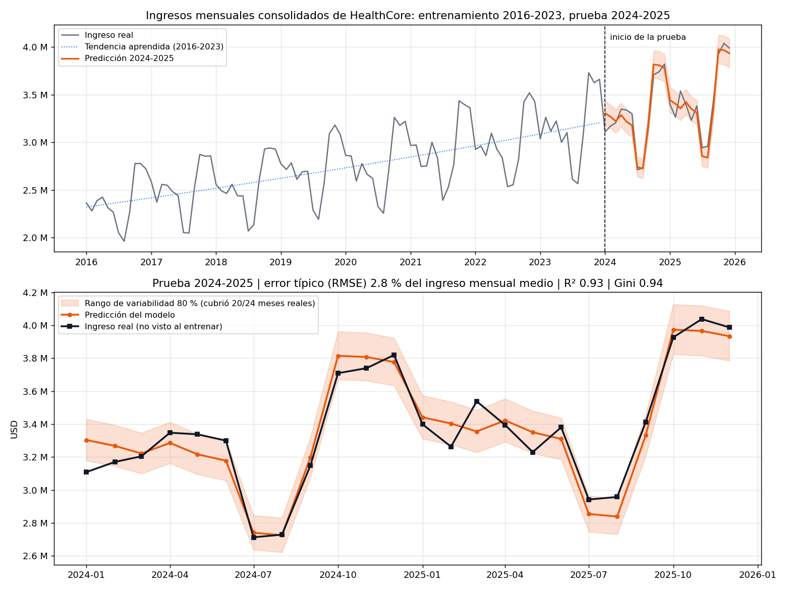

# Modelo de predicción de ingresos mensuales — HealthCore

Respuesta al ticket "Modelo de predicción de ventas" (RFI de Finanzas): ¿se pueden predecir los ingresos de los próximos meses con un error aceptable antes de construir un dashboard ejecutivo?

**Respuesta corta: sí.** Sobre 2024-2025, dos años que el modelo no vio al entrenar, el error típico es del **2,8 % del ingreso mensual medio** (unos 95.000 USD sobre 3,37 M). La franja del 80 % contuvo 20 de los 24 meses reales.

## Cómo ejecutarlo

Desde la raíz del repo:

```bash
uv pip install --python services/api/.venv/bin/python -r requirements-ml.txt   # una vez
services/api/.venv/bin/python scripts/train_sales_forecast.py
services/api/.venv/bin/python -m pytest tests/pipelines/test_sales_forecast.py
```

El script escribe en `docs/sales-forecast/`: `forecast.png`, `metrics.json` y `test_predictions.csv`. Con `random_state=42` el resultado es idéntico en cada ejecución.

| Pieza | Archivo |
|---|---|
| Dataset provisto (copia sin cambios, sha256 `bb4dd512…`) | `data/raw/healthcore_sales.csv` |
| Carga, limpieza, split, modelo y métricas (lógica pura) | `data/process/sales_forecast.py` |
| Entrenamiento, informe y gráfico | `scripts/train_sales_forecast.py` |
| Tests (split 8/2, fuga de datos, limpieza, métricas) | `tests/pipelines/test_sales_forecast.py` |

> **Desviación del enunciado:** el README de la clase pide `uv add` en un proyecto de la raíz. En este monorepo todo el Python se ejecuta con el venv de `services/api`, así que las dependencias se instalan con `uv pip install` en ese venv y se declaran en `requirements-ml.txt`. No van en `services/api/requirements.txt` para no engordar las imágenes Docker de la API y del worker, que no las usan.

## Datos

- 120 filas `consolidated` (2016-01 a 2025-12), sin nulos, sin meses faltantes y con todos los ingresos positivos. Lo valida `validate_sales_data`, así que un CSV que incumpla el CONTEXT falla con un mensaje claro.
- **Nulos:** un `revenue_usd` vacío se reconstruye como `visits_count × avg_revenue_per_visit_usd`, una identidad que en este dataset se cumple exactamente. Si no se puede reconstruir, la fila se descarta y la validación rechaza el hueco: no se entrena con meses inventados. Con el dataset provisto no se activa.
- **Split:** por año natural y en orden cronológico. Entrenamiento: 2016-2023 (96 meses). Prueba: 2024-2025 (24 meses).
- **Solo cifras agregadas mensuales:** ningún dato de pacientes, fuera del alcance de HIPAA y UK GDPR (CONTEXT, sección 1).

## Diseño del modelo

```
ingreso_mes = tendencia(mes) × patrón_estacional(mes_del_año)
```

1. **Tendencia:** regresión lineal sobre `log(ingreso)` con el tiempo transcurrido, ajustada solo con 2016-2023. Aprende un crecimiento del **4,16 % anual**, prácticamente el 4 % del CONTEXT.
2. **Patrón estacional:** un Random Forest (500 árboles) aprende, a partir del mes del año, cuánto se aleja cada mes de su tendencia (alza oct-dic, caída jul-ago).
3. **Franja de variabilidad del 80 %:** percentiles 10 y 90 de los errores *out-of-bag* del bosque. Para cada mes de entrenamiento, la predicción la hacen solo los árboles que no lo vieron.

### Por qué hace falta separar la tendencia

Un Random Forest predice promediando valores que ya vio, así que **nunca predice por encima del máximo del entrenamiento**. El máximo de 2016-2023 es 3,73 M, y 2024-2025 llega a 4,04 M. En una prueba exploratoria con la misma semilla, el bosque entrenado directamente sobre el ingreso tuvo un error medio del **6,0 %** y se quedaba corto en los picos. Separando la tendencia baja al **2,4 %**.

### Por qué no se usan las visitas como variable

En este dataset, `revenue_usd = visits_count × avg_revenue_per_visit_usd` exactamente. Con las visitas del mes, el modelo "adivinaría" el ingreso multiplicando, pero las visitas de un mes futuro no se conocen al predecir. Sería fuga de datos: un error espectacularmente bajo e inútil en la práctica.

### Escalado

El ingreso de 2016 (~2,4 M) y el de 2025 (~3,5 M) no son comparables entre sí. Por eso el bosque no aprende sobre USD, sino sobre el ingreso dividido por su tendencia (valores sin unidades entre ~0,83 y ~1,20). El índice temporal de la tendencia pasa por `StandardScaler`. El mes del año no se escala, porque los árboles comparan umbrales y la magnitud no les afecta. Todo se ajusta solo con entrenamiento.

### Por qué Random Forest y no XGBoost

| Criterio | Random Forest | XGBoost |
|---|---|---|
| **Tamaño de datos** | 96 meses bastan; promediar 500 árboles reduce el sobreajuste | Su ventaja aparece con muchos datos y variables; con 96 filas tiende a memorizar |
| **Explicabilidad para Finanzas** | "Para cada mes del año, el comportamiento típico respecto a la tendencia" | Árboles secuenciales que corrigen al anterior: más difícil de contar |
| **Tiempo de ajuste** | Funciona bien con los valores por defecto | Requiere ajustar tasa de aprendizaje, profundidad y número de rondas |
| **Rango de variabilidad** | Los errores *out-of-bag* salen del propio entrenamiento, sin datos extra | Habría que construirlo aparte (regresión por cuantiles o backtesting) |
| **Dependencias** | Incluido en scikit-learn | Librería adicional |

Finanzas pidió un modelo que no parezca una caja negra antes de invertir en un dashboard, y la precisión obtenida (2,8 %) ya es suficiente para esa decisión. Priorizamos explicabilidad y honestidad del rango sobre una posible décima extra de precisión.

### Por qué la franja no sale de la dispersión entre árboles

La dispersión de las predicciones de los 500 árboles solo mide cuánto dudan **sobre la media de cada mes**, no el ruido de un mes concreto (±5 % según el CONTEXT). Probada esa opción, la franja medía un 2,3 % de ancho y **solo contuvo 4 de los 24 meses reales**: el "número optimista" que el ticket prohíbe. La franja *out-of-bag* dice cubrir el 80 % y cubrió el 83 %.

## Resultados sobre la prueba (2024-2025)



| Métrica | Valor | Lectura |
|---|---|---|
| **MSE** | 8.982.703.155 USD² | Ver abajo por qué no se lee directamente |
| RMSE (raíz del MSE) | 94.777 USD = **2,82 %** del ingreso mensual medio | Error típico de un mes |
| Error medio absoluto | 81.454 USD (**2,44 %**) | Lo que se desvía la predicción en un mes normal |
| **K2 Score (R²)** | **0,929** | El modelo explica el 93 % de la variación mes a mes |
| **Gini normalizado** | **0,936** | Ordena los meses de más a menos ingreso casi como ocurrieron |
| **PSI** mezcla (ingreso por consulta, entrenamiento vs prueba) | **0,480, cambio significativo** | Ver hallazgo abajo |
| PSI predicción vs real (prueba) | 0,093, estable | Las predicciones se reparten como los ingresos reales |
| Franja del 80 % (−3,8 % / +3,9 %) | 20 de 24 meses dentro (**83 %**) | El rango prometido se cumple |

## Qué mide cada métrica

- **MSE (error cuadrático medio):** la media de los errores al cuadrado. Está en USD², una unidad que nadie usa, y castiga mucho los errores grandes. Por eso se reporta también su raíz (RMSE, en USD) como porcentaje del ingreso mensual medio: *"en un mes típico nos equivocamos en torno a un 2,8 %"*.
- **K2 Score (R²):** en el enunciado aparece como "K2 Score", que entendemos como el R² (coeficiente de determinación), porque no existe una métrica llamada K2. Mide qué parte de la variación mes a mes explica el modelo. 1 es perfecto; 0 equivale a predecir siempre la media.
- **Gini normalizado:** ordena los meses de mayor a menor ingreso *predicho* y compara ese orden con el real. 1 = mismo orden; 0 = orden al azar. No mira el tamaño del error, solo el ranking. Es lo que Sandra necesita para distinguir un agosto bajo pero normal de una caída atípica.
- **PSI (Population Stability Index):** compara cómo se reparten los valores en dos periodos, usando 5 cubetas por cuantiles, porque con 24 meses 10 cubetas serían ruido. Umbrales habituales: menos de 0,10, estable; de 0,10 a 0,25, cambio moderado; más de 0,25, cambio significativo.

### Por qué un MSE bajo no basta por sí solo

1. **Depende de la escala:** 9.000 millones de USD² parece enorme y es un 2,8 %. Sin compararlo con el ingreso no dice si el modelo es bueno o malo.
2. **Puede ser bajo por hacer trampa:** medido sobre el entrenamiento, o usando las visitas del mismo mes, el MSE saldría casi cero y el modelo no serviría para el futuro. Por eso todas las métricas se calculan sobre 2024-2025, y un test prueba que alterar esos años no cambia el modelo.
3. **No dice si el modelo ordena bien los meses** (eso lo mide Gini) **ni qué parte del comportamiento explica** (eso lo mide R²).
4. **No avisa de que el negocio cambió** (eso lo mide PSI): un modelo puede acertar hoy sobre un negocio que ya no se parece al del entrenamiento.
5. **Es un solo número:** no dice cuánto puede variar un mes concreto. Eso lo da la franja, con su cobertura comprobada.

## Hallazgo: cambio en la mezcla del negocio (PSI 0,48)

El CONTEXT pide medir con el PSI si cambió la mezcla de visitas entre EE. UU. y Reino Unido. **El CSV provisto no trae filas por país**, así que ese PSI no se puede calcular literalmente. Como indicador indirecto se usa el ingreso medio por consulta, que cambia cuando lo hace la mezcla de sedes o de servicios.

Resultado: pasó de **179,23 USD** de media en 2016-2023 a **181,63 USD** en 2024-2025 (+1,3 %). Además, 11 de los 24 meses de prueba están por encima del percentil 80 del entrenamiento, cuando lo esperado serían unos 5. Es un cambio pequeño pero consistente, que podría reflejar una clínica nueva, una variación de tarifas o un cambio en la proporción EE. UU./Reino Unido. **No degrada el modelo**, porque no usa esa variable (el PSI de predicción vs real es estable). Aun así, conviene que Tom (Revenue Cycle) confirme su origen antes de extender el modelo a más años.

## Limitaciones

- **Una sola serie de 10 años:** la franja se calibra con 96 errores. Con más historia o más detalle (por país o por clínica) sería más fiable.
- **La tendencia asume un crecimiento estable (~4 %).** Un cambio estructural, como una apertura o un cierre, no lo anticipa; el PSI sirve de alarma.
- **Horizonte:** evaluado a 24 meses vista desde diciembre de 2023. Para producción convendría reentrenar cada cierre de mes con todo el histórico disponible.
